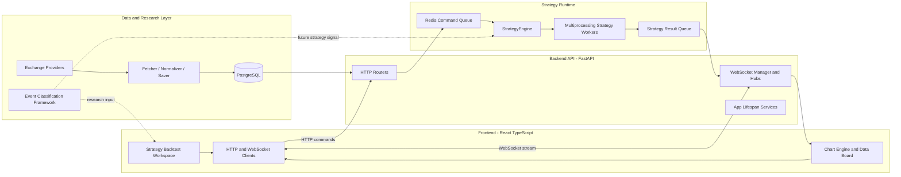

# QATradeSys-Portfolio
# Quantitative Analysis Trading System Portfolio

## 1. Overview

Quantitative Analysis Trading System is a full-stack trading research platform designed for strategy backtesting, market data processing, realtime strategy signal delivery, and event-driven market structure analysis.

The project is built as a research-first system with a path toward automated trading. It combines backend strategy execution, PostgreSQL-based market data storage, Redis/WebSocket realtime messaging, and a React-based frontend workspace for strategy configuration and chart visualization.

Primary engineering goals:

- Build a modular strategy backtesting engine.
- Connect frontend strategy controls with backend runtime execution.
- Stream strategy results and market data back to the UI in realtime.
- Organize market events into a structured framework for future strategy inputs.
- Keep backend, frontend, data pipeline, and research documentation separated by responsibility.

## 2. Tech Stack

| Area | Stack |
| --- | --- |
| Backend API | Python, FastAPI, Pydantic |
| Strategy Runtime | asyncio, multiprocessing, Redis queue |
| Frontend | TypeScript, React, Vite, styled-components |
| Data Storage | PostgreSQL, asyncpg |
| Realtime Messaging | Redis / Memurai, WebSocket |
| Market Data Processing | pandas, numpy, exchange provider pipeline |
| Charting | lightweight-charts, Plotly |
| Tooling | npm, ESLint, Python virtual environment |

## 3. Architecture

The current system is organized into four major layers.

### Frontend Layer

The frontend provides the user-facing strategy workspace. It handles strategy catalog loading, runtime option editing, strategy execution commands, chart rendering, strategy signal display, and analysis board presentation.

Key areas:

- `Frontend/src/ui/pages`: page-level composition.
- `Frontend/src/feature/strategy`: strategy workspace state, option handling, and result mapping.
- `Frontend/src/infrastructure/transport`: HTTP and WebSocket clients.
- `Frontend/src/feature/chartEngine`: chart instance and primitive event management.

### Backend API Layer

The backend API accepts HTTP and WebSocket traffic from the frontend. FastAPI routers receive commands, validate payloads, register listeners, and push strategy commands into Redis-backed queues.

Key areas:

- `Backend/app/ServerAPI.py`: FastAPI app entry and service lifecycle.
- `Backend/app/serverAPI/Routers`: strategy, K-line, config sync, and databoard endpoints.
- `Backend/app/serverAPI/hubs`: WebSocket distribution and listener management.

### Strategy Engine Layer

The strategy engine separates API requests from runtime execution. Commands are queued through Redis and dispatched into multiprocessing workers. Strategy workers manage active strategies, runtime option patches, indicator parameter patches, and result generation.

Key areas:

- `Backend/app/strategyAnalysis/strategy_engine_layer.py`
- `Backend/app/strategyAnalysis/strategy_active_layer.py`
- `Backend/app/strategyAnalysis/strategyStorage`
- `Backend/app/strategyAnalysis/runtime_types.py`

### Data and Research Layer

The data layer manages market data pipelines and PostgreSQL access. The research layer defines event classification, market structure scoring, and transmission-chain documentation for future strategy inputs.

Key areas:

- `Backend/app/strategyAnalysis/dataRegularUpdateService`
- `Backend/app/dataPipeline/database`
- `docs/finance/EventClassification.md`
- `agent/batch_time_range_processor.py`
- `agent/generate_jan2019_event_classification.py`

## 4. Features

### Implemented

- Strategy catalog loading from backend.
- Frontend strategy selection and runtime parameter configuration.
- Strategy add/delete/apply-options command flow.
- Redis-backed strategy command queue.
- Multiprocessing backend strategy engine.
- WebSocket-based strategy result delivery.
- Chart workspace with strategy signal visualization.
- K-line receiver registration through backend API.
- PostgreSQL-backed market data access layer.
- Exchange provider pipeline structure for market data fetching.
- Event-driven market classification framework.
- Uranium and nuclear fuel inventory coverage under energy material analysis.

### In Progress / Planned

- Production deployment configuration.
- Full automated integration tests for API, Redis, WebSocket, and strategy engine flows.
- Live-trading execution layer.
- More exchange providers and broader market coverage.
- Strategy run comparison and portfolio-level risk dashboard.
- Environment-based Redis and backend configuration.

## 5. Architecture Diagram

## 6. Screenshots

Add screenshots here after capturing the application UI.

### Strategy Backtest Workspace

<!-- Screenshot placeholder: Strategy Backtest page -->

### Chart and Strategy Signals

<!-- Screenshot placeholder: Chart with strategy markers -->

### Analysis Board / History Record

<!-- Screenshot placeholder: Analysis board or history record UI -->

